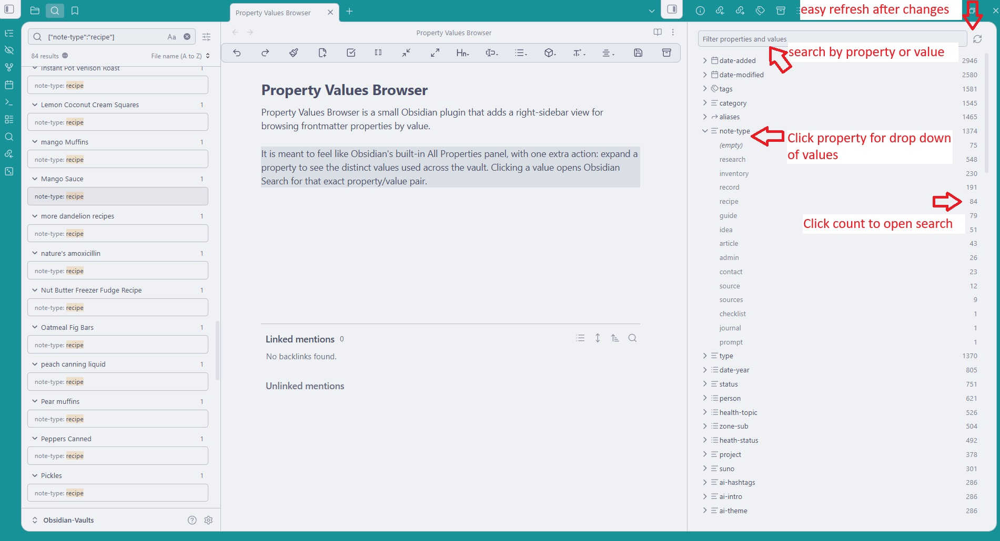

# Property Values Browser


Property Values Browser is a small Obsidian plugin that adds a right-sidebar view for browsing frontmatter properties by value.

It is meant to feel like Obsidian's built-in All Properties panel, with one extra action: expand a property to see the distinct values used across the vault. Clicking a value opens Obsidian Search for that exact property/value pair.



## Features

- Shows frontmatter property names with total counts.
- Expands each property to show distinct values with counts.
- Counts list values separately, whether YAML is inline or multiline.
- Shows blank/null values as `(empty)`.
- Filters property names and values from the top input.
- Clicks property counts to search for every note with that property.
- Clicks value rows to search for notes with that exact property/value pair.
- Adds a ribbon icon and command palette command.
- Includes a manual refresh button.

## Manual install

Download `property-values-browser.zip` from a release and extract it into:

```text
<your vault>/.obsidian/plugins/property-values-browser/
```

The folder should contain:

```text
main.js
manifest.json
styles.css
```

Then reload Obsidian and enable **Property Values Browser** in Community plugins.

## Install from source

From this folder:

```powershell
npm install
npm run build
npm run install-plugin
```

Then reload Obsidian and enable **Property Values Browser** in Community plugins.

If npm is not available by name on this computer, use:

```powershell
& "C:\Program Files\nodejs\npm.cmd" install
& "C:\Program Files\nodejs\npm.cmd" run build
& "C:\Program Files\nodejs\npm.cmd" run install-plugin
```
